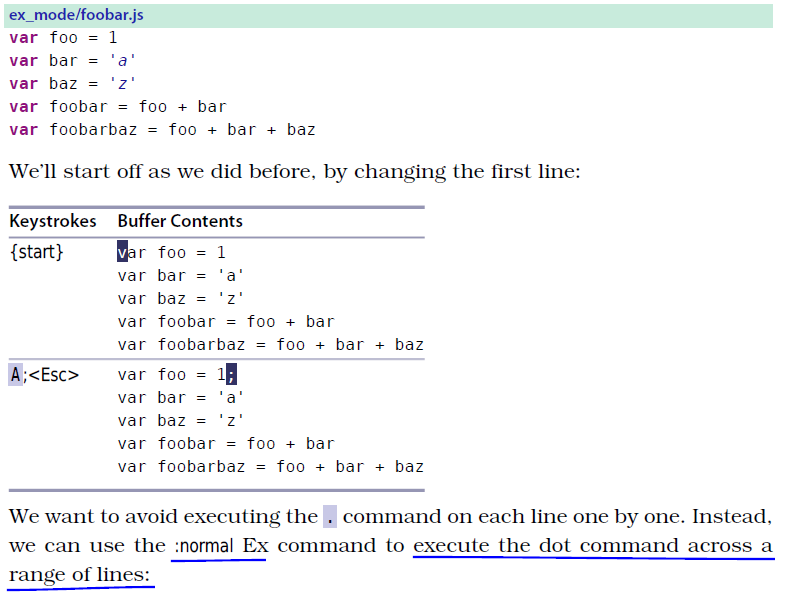
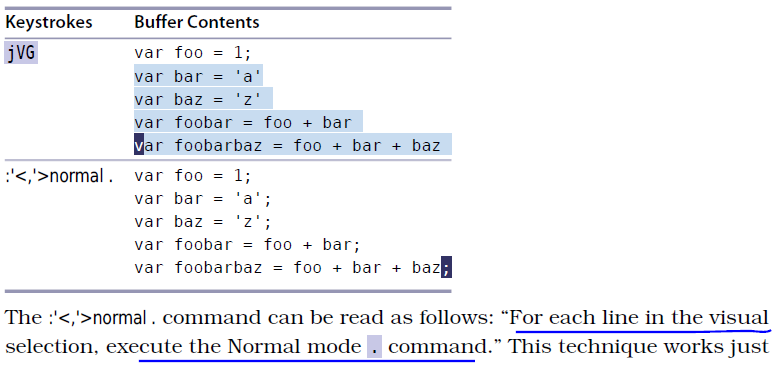

# Tip30: Run Normal Mode Commands Across a Range

## :normal
>run a Normal mode command on a series of consecutive lines.

Note: we can use :normal to execute any Normal mode commands.

## :%normal A;
>append a semicolon at the end of every line of the file.

## :%normal i//
>comment out an entire file.

# [Tip29](tip29.md) [Tip31](tip31.md)
