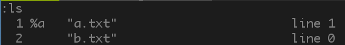

# Tip36: Track Open Files with the Buffer List  
  
We can load multiple files during an editing session. Vim lets us manage them using the **buffer list**.  
  
**Understand the Distinction Between Files and Buffers**  
  
Vim allows us to read files, edit them, and save our changes. But we are **not** editing a file. Instead, we're editing an **in-memory representation of a file**, which is called **buffer**.  
  
**Files** are stored on the disk.  
**Buffers** exist in memory.  
When we open a file in vim, its contents are read into a buffer, which takes the same name as the file.  
  
Initially, the contents of the buffer will be identical to those of the file, but the two will diverge as we make changes to the buffer.  
  
If you decide that you want to keep your changes, you can write the contents of the buffer back into the file.  
  
Most vim commands operate on buffers, but a few operate on files, including the `:write`, `:update`, `:saveas` commands.  
  
  
**Meet the Buffer List**  
  
Vim allows us to work with multiple buffers simultaneously.  
`vim *.txt`:  
>`*.txt`: this wildcard matches two files in the current directory: a.txt, b.txt  
>This cmd tells vim to open both of those files.  
>When vim starts up, it shows **a single window** with a buffer representing the first of the two files. The other file **isn't visible**, but it has been loaded into a buffer in the background.  
  
  
`:ls`: command gives us a listing of all the buffers that have been loaded into memory.  
  
switch to next buffer: `:bnext`  
  
`%`: indicates which of the buffers is visible in the current window.  
`#`: represents the alternate file.  
`<C-^>`: quickly toggle between the current and alternate files.  
  
  
**Use the Buffer List**  
  
Traverse the buffer list:  
>`:bprev`: move backward  
>`:bnext`: move forward  
>`:bfirst`: jump to the start of the list  
>`:blast`: jump to the end of the list  
  
## :buffer N  
>jump directly to a buffer by number. because `:ls` listing starts with a digit, which is assigned to each buffer automatically on creation.  
  
## :buffer {bufname}  
>{bufname} need only contain enough characters from the filepath to uniquely identify the buffer.  
  
## :bufdo :argdo  
>execute an Ex command in all of the buffers listed by `:ls`.  
  
  
**Deleting Buffers**  
  
## :bd[elete]  
>`:bdelete N1 N2 N3`:  `:bd 5 6 7`  
>`:N,M bdelete`: `:5,10bd`  
Note: deleting a buffer has no effect on its associated file. it simply removes the in-memory representation.  
  
Buffer numbers are automatically assigned by Vim, and we have no means of changing them by hand. So if we want to delete one or more buffers, we first have to look them up to find out their numbers, this is time-consuming, so unless I have a good reason to delete a buffer, I usually don't bother!  
  
Note: Vim's built-in controls for managing the buffer list lack flexibility. If we want to arrange buffers in a way that makes sense for our workflow, attempting to organize the buffer list is not the way to go. Instead, we're better off dividing our workspace using **split windows**, **tab pages**, or the **argument list**.  
  
# [Tip35](tip35.md) [Tip37](tip37.md)
